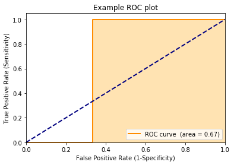

[wvpy](https://github.com/WinVector/wvpy) is a simple 
set of utilities for teaching data science and machine learning methods.
They are not replacements for the obvious methods in sklearn.


```python
import wvpy.util

wvpy.__version__
```


    '0.2.0'


Illustration of cross-method plan.


```python
wvpy.util.mk_cross_plan(10,2)

```


    [{'train': [0, 1, 4, 5, 7], 'test': [2, 3, 6, 8, 9]},
     {'train': [2, 3, 6, 8, 9], 'test': [0, 1, 4, 5, 7]}]


Plotting example


```python
import pandas
```


```python
d = pandas.DataFrame({
    'x': [1, 2, 3, 4, 5],
    'y': [False, False, True, True, False]
})
```


```python
help(wvpy.util.plot_roc)
```

    Help on function plot_roc in module wvpy.util:
    
    plot_roc(prediction, istrue, title='Receiver operating characteristic plot')
        plot a ROC curve of numeric prediction against boolean istrue
    


```python
wvpy.util.plot_roc(
    prediction=d.x,
    istrue=d.y,
    title='Example ROC plot')
```





    0.6666666666666667


```python

```
