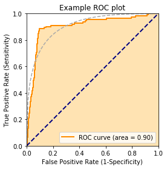
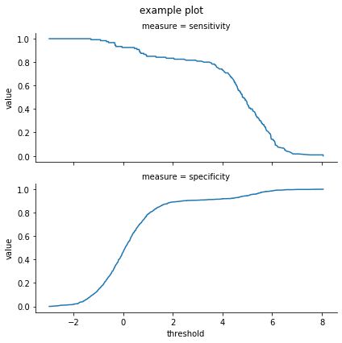
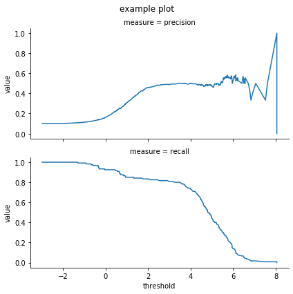
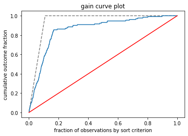
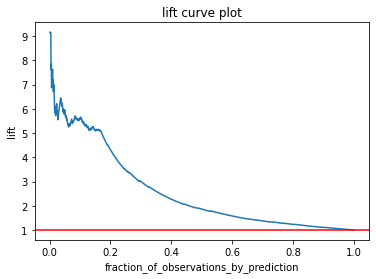

[wvpy](https://github.com/WinVector/wvpy) is a simple 
set of utilities for teaching data science and machine learning methods.
They are not replacements for the obvious methods in sklearn.

Some notes on the Jupyter sheet runner can be found [here](https://win-vector.com/2022/08/20/an-effective-personal-jupyter-data-science-workflow/)


```python
import numpy.random
import pandas
import wvpy.util

wvpy.__version__
```


    '0.2.7'


Illustration of cross-method plan.


```python
wvpy.util.mk_cross_plan(10,2)
```


    [{'train': [1, 2, 3, 4, 9], 'test': [0, 5, 6, 7, 8]},
     {'train': [0, 5, 6, 7, 8], 'test': [1, 2, 3, 4, 9]}]


Plotting example


```python
help(wvpy.util.plot_roc)
```

    Help on function plot_roc in module wvpy.util:
    
    plot_roc(prediction, istrue, title='Receiver operating characteristic plot', *, truth_target=True, ideal_line_color=None, extra_points=None, show=True)
        Plot a ROC curve of numeric prediction against boolean istrue.
        
        :param prediction: column of numeric predictions
        :param istrue: column of items to predict
        :param title: plot title
        :param truth_target: value to consider target or true.
        :param ideal_line_color: if not None, color of ideal line
        :param extra_points: data frame of additional point to annotate graph, columns fpr, tpr, label
        :param show: logical, if True call matplotlib.pyplot.show()
        :return: calculated area under the curve, plot produced by call.
        
        Example:
        
        import pandas
        import wvpy.util
        
        d = pandas.DataFrame({
            'x': [1, 2, 3, 4, 5],
            'y': [False, False, True, True, False]
        })
        
        wvpy.util.plot_roc(
            prediction=d['x'],
            istrue=d['y'],
            ideal_line_color='lightgrey'
        )
        
        wvpy.util.plot_roc(
            prediction=d['x'],
            istrue=d['y'],
            extra_points=pandas.DataFrame({
                'tpr': [0, 1],
                'fpr': [0, 1],
                'label': ['AAA', 'BBB']
            })
        )
    


```python
d = pandas.concat([
    pandas.DataFrame({
        'x': numpy.random.normal(size=1000),
        'y': numpy.random.choice([True, False], 
                                 p=(0.02, 0.98), 
                                 size=1000, 
                                 replace=True)}),
    pandas.DataFrame({
        'x': numpy.random.normal(size=200) + 5,
        'y': numpy.random.choice([True, False], 
                                 size=200, 
                                 replace=True)}),
])
```


```python
wvpy.util.plot_roc(
    prediction=d.x,
    istrue=d.y,
    ideal_line_color="DarkGrey",
    title='Example ROC plot')
```


    <Figure size 432x288 with 0 Axes>


    

    


    0.903298366883511


```python
help(wvpy.util.threshold_plot)
```

    Help on function threshold_plot in module wvpy.util:
    
    threshold_plot(d: pandas.core.frame.DataFrame, pred_var, truth_var, truth_target=True, threshold_range=(-inf, inf), plotvars=('precision', 'recall'), title='Measures as a function of threshold', *, show=True)
        Produce multiple facet plot relating the performance of using a threshold greater than or equal to
        different values at predicting a truth target.
        
        :param d: pandas.DataFrame to plot
        :param pred_var: name of column of numeric predictions
        :param truth_var: name of column with reference truth
        :param truth_target: value considered true
        :param threshold_range: x-axis range to plot
        :param plotvars: list of metrics to plot, must come from ['threshold', 'count', 'fraction', 'precision',
            'true_positive_rate', 'false_positive_rate', 'true_negative_rate', 'false_negative_rate',
            'recall', 'sensitivity', 'specificity']
        :param title: title for plot
        :param show: logical, if True call matplotlib.pyplot.show()
        :return: None, plot produced as a side effect
        
        Example:
        
        import pandas
        import wvpy.util
        
        d = pandas.DataFrame({
            'x': [1, 2, 3, 4, 5],
            'y': [False, False, True, True, False]
        })
        
        wvpy.util.threshold_plot(
            d,
            pred_var='x',
            truth_var='y',
            plotvars=("sensitivity", "specificity"),
        )
    


```python
wvpy.util.threshold_plot(
        d,
        pred_var='x',
        truth_var='y',
        plotvars=("sensitivity", "specificity"),
        title = "example plot"
    )
```


    

    


```python

wvpy.util.threshold_plot(
        d,
        pred_var='x',
        truth_var='y',
        plotvars=("precision", "recall"),
        title = "example plot"
    )
```


    

    


```python
help(wvpy.util.gain_curve_plot)
```

    Help on function gain_curve_plot in module wvpy.util:
    
    gain_curve_plot(prediction, outcome, title='Gain curve plot', *, show=True)
        plot cumulative outcome as a function of prediction order (descending)
        
        :param prediction: vector of numeric predictions
        :param outcome: vector of actual values
        :param title: plot title
        :param show: logical, if True call matplotlib.pyplot.show()
        :return: None
    


```python
wvpy.util.gain_curve_plot(
        prediction=d['x'],
        outcome=d['y'],
        title = "gain curve plot"
)
```


    

    


```python
wvpy.util.lift_curve_plot(
        prediction=d['x'],
        outcome=d['y'],
        title = "lift curve plot"
)
```


    

    


```python

```
